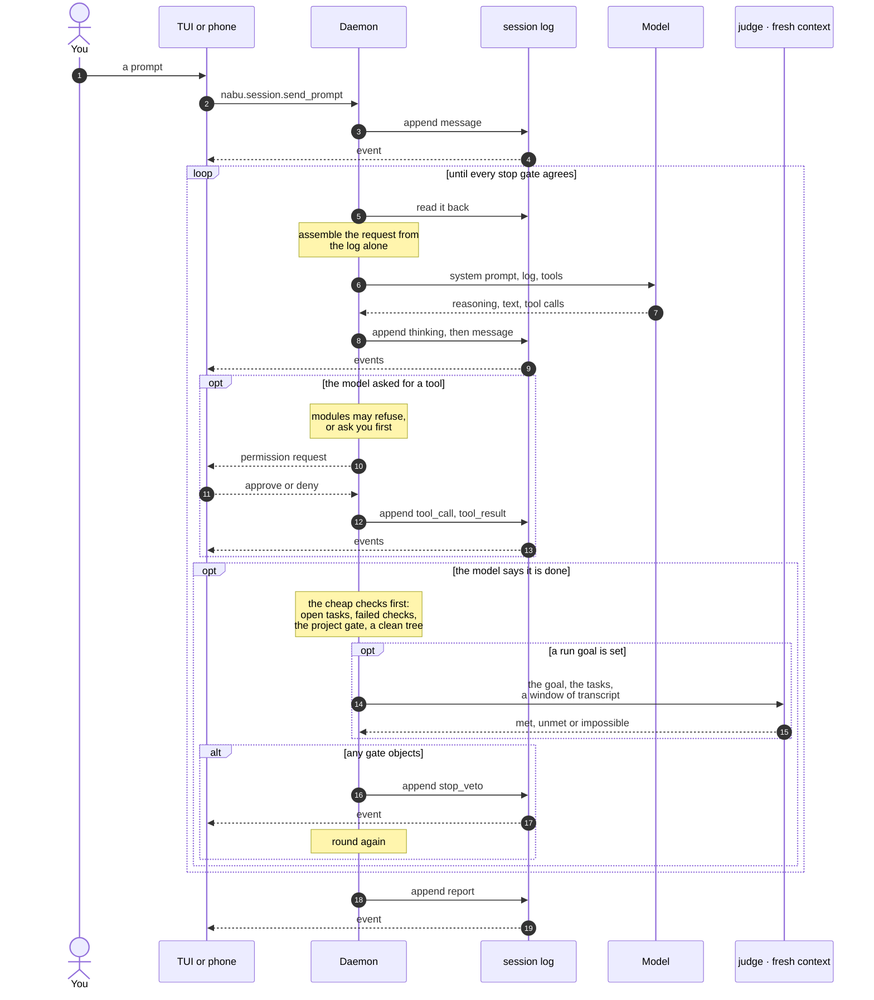

# nabu

A self-contained, custom, multiplatform coding harness built in Go.

Nabu was the Mesopotamian god of scribes and record-keeping. The name is the design:
every session is an append-only log, and every request to the model is built from that
log. Most of what follows falls out of it.

I built it because I wanted a Claude Code-like experience that I own outright. There is
no plugin system and no extension API, because there is nothing to extend around: if it
should behave differently, I change it. The source is the customisation layer.

> **Status:** early, and built for one person's daily use. It drives a local model
> through real work every day. Interfaces still move and there is no release or
> installer: both clients are built from source.

## Requirements

- Go 1.26 or newer
- An OpenAI-compatible model endpoint. A local `llama-server` works; so does anything
  that speaks the same API.
- Git, optionally. Without it you lose memory versioning and some reporting, nothing
  else.

Developed on Windows, with the tests run on macOS and Linux in CI too. The daemon and
CLI are pure Go with no cgo, so they build and cross-compile anywhere Go runs.

## Install

```bash
git clone https://github.com/corporealshift/nabu
cd nabu
go install ./cmd/nabu
```

That puts `nabu` in your Go bin directory, which you may need to add to your PATH.

When you upgrade later, stop the daemon first with `nabu daemon stop`. A running
daemon holds the binary open and the install will fail.

### Building for another machine

`scripts/build-release.sh` cross-compiles into `dist/` for macOS on Apple silicon and
Intel, Linux on x86-64 and arm64, and Windows. Any one machine builds all of them.

```bash
./scripts/build-release.sh 0.1.0
```

Nothing is code-signed or notarised. On macOS a binary you built or copied across runs
without complaint; one downloaded through a browser is quarantined and needs
`xattr -d com.apple.quarantine nabu` first.

## Configure

nabu keeps everything under `~/.nabu`. Create `~/.nabu/config.json`:

```json
{
  "daemon": {
    "default_model": "local/my-model"
  },
  "providers": {
    "local": {
      "base_url": "http://localhost:8033/v1",
      "api_key": "none",
      "context_window": 128000
    }
  }
}
```

That is the minimum. Two things to know:

- **`default_model` is `provider/model`.** The part before the slash picks the provider
  block; the rest is sent to the endpoint as the model name.
- **Set `context_window`.** Without it nabu cannot tell how full the context is, so it
  never compacts, and a long session grows until your model refuses the request. It is
  also what the clients read to show how full the window is, and they say nothing rather
  than guess when it is unset.

Unknown fields are rejected rather than ignored, so a typo fails loudly at startup
instead of silently doing nothing.

### Reading another repository

A session is bound to one workspace, and writing never leaves it. Reading can, if you
list the repositories it may read. Add a `modules.builtins` block:

```json
{
  "modules": {
    "builtins": {
      "workspaces": {
        "nabu": "C:/Users/you/projects/nabu",
        "mealemon-web": "C:/Users/you/projects/mealemon-web"
      }
    }
  }
}
```

`read`, `glob` and `grep` then take an optional `workspace` naming one of these, and
hits come back relative to that repository's root so the model can pass a path straight
back. With nothing configured the argument does not appear in the tools' schemas at all,
so the model is never offered an ability the daemon has not been given.

**Writes never cross.** `write`, `edit` and `bash` do not take the argument and stay in
the session's workspace. Reading another repository is a convenience with a bounded
blast radius; writing to one is not.

The list is names, not paths the model supplies: there is no spelling of a name that
reaches a directory you did not list, and a path that climbs out of a named root with
`../` is refused.

### Asking Claude

nabu can fetch a second opinion for itself, instead of you carrying the message. The
`claude.ask` tool runs the `claude` CLI in the session's workspace, so Claude reads the
same repository nabu is working in — the diff, the spec, the code.

It appears only when `claude` is on PATH. To tune it, add a `modules.claude` block:

```json
{
  "modules": {
    "claude": {
      "enabled": true,
      "timeout_seconds": 300,
      "model": "",
      "allowed_tools": ["Read", "Grep", "Glob"]
    }
  }
}
```

**The reviewer is read-only.** `allowed_tools` defaults to reading only, because a
reviewer that can quietly edit the repository removes the one thing a review is for — that
somebody else looked and did not touch it. Verified rather than assumed: asked to create a
file under these flags, Claude reports the write blocked and no file appears.

The cost is that Claude cannot run your tests. nabu can: it runs them and puts the output
in the prompt. Claude does not need a shell to know a test failed.

It uses whatever `claude` login is on the machine, so it spends your Claude Code
allowance. Each call is slow and real money, from a process you are not watching — the
timeout bounds one call, nothing bounds how many a run makes. Set `enabled: false` to turn
it off.

### Working notes

The agent keeps notes on what it worked out in a repository — dead ends, why one thing
has to happen before another, how far through a refactor it got. They outlive the
session, so a multi-session task picks up where it left off, and they expire on their
own so they do not become a second memory.

Notes are named by the agent, many per repository, so an effort gets its own:

```
notes.write("simplefin-sync-refactor", "...")
```

While the work continues the agent rewrites that note, which resets its clock; when the
work stops nobody touches it and it ages out. Default is 14 days. Add a `modules.notes`
block to change it:

```json
{
  "modules": {
    "notes": {
      "enabled": true,
      "expire_days": 14,
      "max_bytes": 4096
    }
  }
}
```

**Reading them yourself.** They are plain markdown at
`~/.nabu/notes/ws/<workspace-key>/<name>.md`, so you can open, grep or diff them like
anything else. Or:

```
nabu notes           # this repository's notes
nabu notes --all     # every repository's
```

A note belongs to the repository, not the directory: the workspace key is the same
across worktrees and subdirectories of one repo, so notes follow the project rather
than wherever you happened to start the session.

Not to be confused with memory, which is for facts you told the agent that the code
does not record and which stay true indefinitely. A note is working state, and working
state goes stale — the age beside each one is there so you can see when it has.

### Noticing changes you make yourself

If you edit the workspace from another terminal while a session is running, the agent
is told. Before each request the daemon compares the workspace against a snapshot taken
at the previous turn boundary and, when something moved, appends a `context` event
listing the paths.

It is on by default. To tune or disable it, add a `modules.watch` block:

```json
{
  "modules": {
    "watch": {
      "enabled": true,
      "max_files": 20000,
      "max_reported": 20
    }
  }
}
```

The agent's own `write` and `edit` calls are suppressed, so it is told about your edits
and not its own. `.git`, `node_modules`, `build`, `target` and `vendor` are skipped, so
a compile does not look like the repository being rewritten. A workspace holding more
than `max_files` files is not scanned at all, and says so in the daemon log rather than
paying for a walk on every request.

It never interrupts a turn: changes that land mid-turn appear in the next request.

### Searching the web

Off until you give it a key. Add a `modules.web` block:

```json
{
  "modules": {
    "web": {
      "provider": "brave",
      "brave_api_key": "...",
      "tavily_api_key": "..."
    }
  }
}
```

Two services, because they answer different questions:

- **Brave** returns an index's links and snippets, which the model follows with
  `web.fetch`. The free tier needs an account but no card.
- **Tavily** is built for agents: it returns cleaned page text and often a direct
  answer, so a search costs fewer follow-up fetches.

Configure both and **the agent chooses per search**, by what it wants back rather than
by which company it asks: `mode: "links"` for ranked sources to follow with `web.fetch`,
`mode: "answer"` for a read reply to a small factual question. The choice only appears
in the tool's schema when both keys are configured, so the model is never offered a
decision it cannot act on.

`provider` is the default for a search that names no mode, not a restriction. With one
key, that service answers everything and the mode parameter is not offered. With
neither key the module offers no tools at all, rather than a tool that fails the first
time the model reaches for it.

`web.fetch` reads http and https only, caps a page at 200 KB, and is classed
medium-risk: what comes back is whatever the page decided to say.

## Use it

```bash
nabu
```

That's the whole thing. It creates a session in the current directory, starts a daemon
if one isn't running, and opens the terminal UI.

| Key | What it does |
|---|---|
| `i` | Type a prompt |
| `s` | Switch sessions |
| `t` | Show or hide the model's thinking |
| `y` / `n` | Answer a permission prompt |
| `ctrl+x` | Interrupt the current turn |
| `g` / `G` | Jump to the top or bottom of the transcript |
| `q` | Quit, leaving the run going |

When the agent asks you something, the question takes the screen: a number picks one of
the offered answers, or type your own and press enter. Everything else you type goes
into the answer, so `q` does not quit while one is on screen.

In the composer, a line starting with `/` is a command rather than a prompt: `/goal
<text>` sets the run goal, `/goal` on its own clears it, `/stop` ends the session,
`/sessions` switches, `/help` lists them.

Quitting does not stop the run. Reopen with `nabu --session <id>` or press `s` and pick
it.

### Headless

```bash
nabu run "add a health endpoint and a test for it"
```

Runs to completion, prints a report, and exits with a status that says what happened:
0 completed, 1 blocked, 2 paused, 3 error. Good for scripting, and for handing work to
nabu from another agent.

Add a goal and it is judged in a fresh context before the run is allowed to finish:

```bash
nabu run --done-when "the new endpoint has a passing test" "add a health endpoint"
```

### The rest

```bash
nabu status            # list sessions
nabu status <id>       # one session's state
nabu attach <id>       # stream a session's events
nabu stop <id>         # end a session
nabu resume <id>       # resume a paused one
nabu daemon            # run the daemon in the foreground
nabu daemon stop       # stop it
```

## Why it looks like this

**Self-contained.** One binary. No Node, no Python, no runtime to install, nothing
downloaded at startup. The daemon, the terminal UI and the headless CLI are the same
executable, and the only hard dependency is a model endpoint to talk to.

**Custom.** Policy lives in Go modules compiled into that binary: what the agent is
allowed to run, when it is allowed to stop, what it remembers. Adding behaviour means
adding a file and a line to a list, not learning an extension format that someone
designed for a general case I do not have.

**Multiplatform,** in two senses. It builds for macOS, Linux and Windows, and the tests
run on all three in CI. And a session is not tied to whatever is looking at it: a
daemon owns the sessions and clients attach to it, so the terminal is not the only way
in.

## How a request travels

Everything is an append-only log of events. The daemon owns it, clients read it, and
nothing else is the truth: a client that reconnects replays from the log rather than
being told what it missed.



The loop is the part worth understanding. The model does not decide when it has
finished: it says so, and the stop gates are asked whether that is true. Any objection
appends a veto and sends it back round. That is why the same session can keep working
after you close the terminal, and why two clients can watch it at once — neither is
driving it.

The last of those gates is another model. When a run has a goal, the judge is given the
condition, the tasks and a window of transcript — never the loop's own history, so it is
not being asked to agree with itself — and answers met, unmet or impossible. It is a
second model call on every stop attempt, which is why the mechanical checks are asked
first: a stop that is obviously wrong should never cost one. A judge call that fails or
answers in the wrong shape counts as unmet, because a judge that fails open would make
the whole mechanism theatre.

## What it actually does

**It refuses to claim it is done when it isn't.** When the agent thinks it has
finished, a stop gate asks whether tasks are still open, whether the project's test
command passes, whether this session left uncommitted changes, and whether the stated
goal was met. Any objection sends it back to work. The model's account of its own
success is not treated as evidence.

**It remembers between sessions.** After a session ends, a curator asks whether
anything in it is worth keeping and writes what it finds as markdown under
`~/.nabu/memory`. The next session on that repository starts already knowing. That
directory is a git repository, so you can read, diff and revert whatever it chose to
remember.

**The run outlives the window.** Quit the terminal UI and the agent keeps working.
Reattach and the transcript replays from where you left off. Two clients can watch the
same session at once.

**It only interrupts for things that matter.** A guard judges a command by what it
would do rather than what it is called. `rm -rf build` runs. `rm -rf /etc` asks.

**It asks instead of guessing.** When the work genuinely forks and the choice is yours
— which of two designs, which file you meant, whether to do something that cannot be
undone — the agent can put the question to whichever client is attached, phone included,
and waits. The first answer wins. This is separate from permission, which is asked for
it rather than by it.

## What the agent can do

Built-in tools: `read`, `write`, `edit`, `glob`, `grep`, `bash`, and `task.update` for
its own task list. Modules add `skill.load`, `memory.recall`, `memory.save`,
`memory.forget`, and `ask`. With a key configured, `web.search` and `web.fetch` as well.

## Making it yours

Everything below is optional. nabu works with none of it.

### Your test command

```json
{ "modules": { "verify": { "command": "go build ./... && go test ./..." } } }
```

Now the agent cannot finish a run while that command fails. This is the single most
useful thing to configure.

### Memory

On by default. To seed it from an existing Claude Code memory directory, read-only:

```json
{ "modules": { "memory": { "import_dirs": ["~/.claude/projects/<project>/memory"] } } }
```

Turn the automatic writing off with `"curator": false` and the `memory.save` tool still
works when the model chooses to use it.

### Skills

Markdown instructions the agent can load on demand. It reads `~/.claude/skills` and
`~/.nabu/skills` by default; point it elsewhere with
`{"modules": {"skills": {"paths": ["..."]}}}`.

### Permission mode

Sessions default to `auto`: the guard decides, and only genuinely dangerous calls reach
you. `ask` prompts for everything, `bypass` for nothing. Per session, not global.

### Budgets

```json
{ "budget": { "max_turns": 100 } }
```

Turns are the unit. A run that exhausts its budget pauses rather than dying, and
`nabu resume` continues it.

## Clients

- **Terminal UI** — the default, in this repo, built with the daemon.
- **Headless CLI** — `nabu run`, same binary.
- **Android** — Kotlin and Compose, under `clients/android`. Sessions, a transcript
  with markdown, the model's thinking, tasks, permission prompts and questions, and an
  outbox that holds a prompt written with no signal and sends it when there is one.
  Built and installed from source; there is no release.
- **Desktop GUI** — a later milestone, not started.

The protocol is JSON-RPC over WebSocket and is specified in `protocol/spec.md` with
conformance vectors, so a client can be written in anything.

## Remote access

The daemon binds to loopback by default. To reach it from a phone, bind wider and set a
token:

```json
{ "daemon": { "bind": "0.0.0.0:8737", "token": "a-long-random-string" } }
```

A connection from anywhere but loopback is refused without that token. This matters:
the daemon runs shell commands in your repositories. Use Tailscale or a comparable
private network rather than exposing the port.

## Where things live

```
~/.nabu/
  config.json
  sessions/     one append-only .jsonl per session
  memory/       markdown, and a git repository
  skills/
  modules/      whatever a module keeps for itself
  daemon.log    beside daemon.pid and daemon.port
```

Session logs are plain JSON lines. You can read one with `cat`, and nothing is hidden
from you.

## Measuring it

`bench/` runs the same tasks through nabu, pi and Claude Code and reports what each one
completed, what it cost, and how the diff reads.

```bash
go run ./cmd/nabubench                  # nabu against pi, the whole suite
go run ./cmd/nabubench --claude         # add the reference, and spend Claude quota
```

Never in CI, and there is no pass mark: the exit code says the suite ran, not that
anything did well. Tasks are split into a `basic` tier that confirms a harness works at
all and a `hard` tier meant to tell good ones apart, and some keep part of their check
back until the harness has finished — a check the agent can run is a check it can grind
against, which measures persistence rather than understanding. `bench/README.md` has the
rest.

## Contributing

Read `ARCHITECTURE.md` first; it is short and states the invariants. The full design,
including every rejected alternative, is under `docs/specs/`.

The gate, which CI runs on Linux, macOS and Windows:

```bash
go build ./... && go vet ./... && go test ./... && gofmt -l .
```

Policy belongs in a module under `daemon/modules/`, not in the daemon core. Changing
the protocol means changing the spec, the JSON schema and a conformance vector together.

## Licence

MIT. See `LICENSE`.
