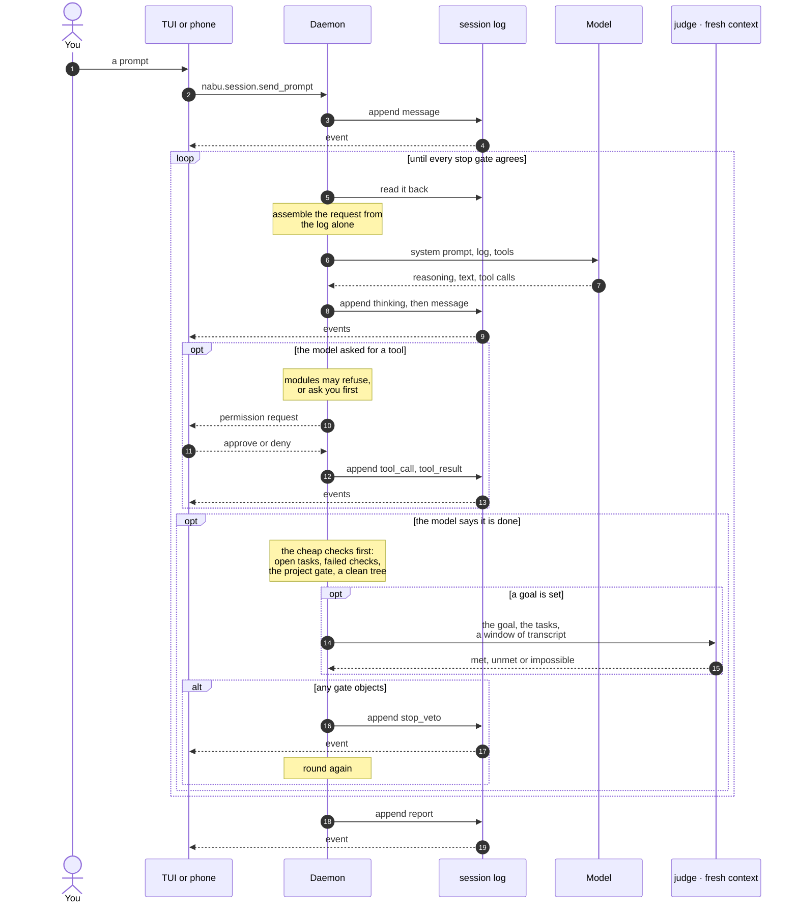

# How it works

Read `ARCHITECTURE.md` for the map and its invariants. Every design decision, with the
alternatives it rejected, is recorded under `docs/specs/`. This page covers the parts
you notice when you use nabu.

## One log per session

Every session is an append-only log of events. The daemon owns it, clients read it, and
nothing else is the record. Each request to the model is built from that log alone. A
client that reconnects replays the log instead of being told what it missed. That is why
a session keeps working after you close the terminal, and why two clients can watch it
at once: neither one is driving it.

## Stop gates

The model doesn't decide when it has finished. It says it has finished, and the stop
gates check whether that's true. They ask:
- whether tasks are still open;
- whether a task's check failed;
- whether the project's test command passes;
- whether the session left uncommitted changes;
- whether a stated goal was met.

Any objection appends a veto and sends the model back to work.

The last gate is another model. When a session has a goal, a judge gets the goal, the
tasks and a window of the transcript, and answers met, unmet or impossible. It never sees
the loop's own history, so it isn't asked to agree with itself. A judge call costs a
second model request, so the mechanical checks run first: an obviously wrong stop should
never cost one. A judge call that fails, or answers in the wrong shape, counts as unmet.
A judge that let a failure through would make the gate pointless.

## Permission

A guard judges a command by what it would do, not by its name. `rm -rf build` runs, and
`rm -rf /etc` asks you first. This is separate from the `ask` tool. With `ask`, the agent
puts a real choice to you, such as which of two designs, or whether to do something that
can't be undone. The question goes to whichever client is attached, phone included, and
the first answer wins.

## Memory and notes

After a session ends, a curator decides whether anything in it is worth keeping, and
writes it to `~/.nabu/memory`. The next session on that repository starts out knowing it.
Memory is for facts that stay true. Working notes (`notes.write`) are for the state of
work in progress, and they expire when nobody touches them.

## Tools

Built in: `read`, `write`, `edit`, `glob`, `grep`, `bash`, `task.update` and `wait`.

Modules add:
- `git`;
- `ask`;
- `skill.load`;
- `memory.recall`, `memory.save` and `memory.forget`;
- `notes.write` and `notes.delete`;
- `artifact`;
- `claude.ask`, when the `claude` CLI is on PATH;
- `web.search` and `web.fetch`, when a key is configured.

## Clients

The protocol is JSON-RPC over WebSocket. `protocol/spec.md` specifies it, with
conformance vectors, so a client can be written in any language. The terminal UI and the
headless CLI are built into the `nabu` binary. The Android client is in `clients/android`
([android.md](android.md)). A desktop GUI is planned but not started.
